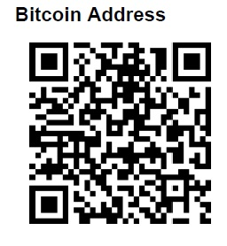

-------

[首页](https://summer2009.github.io/BlockChain2018/)----[区块链知识](https://summer2009.github.io/BlockChain2018/)----[区块链项目](https://summer2009.github.io/BlockChain2018/)
----

 

--------------

##2018.03.09 开始

**每个人都有自己的“全知遮蔽”，就像每个人都看不见自己的后脑勺一样。在自己的视野内，在自己的舒适区，如鱼得水，但是就是这种感觉最容易让自己以为“自己以为的”就是客观事实。**

**正确的态度是研究搞懂，之后才有资格做判断。**

**突破你的全知遮蔽！**

# 对个人来说，区块链最大的风险是拒绝参与！ #

----

+ 区块链基础

    + [区块链知识卡](bc_card.md)
    
    + [BlockChain技术与应用初探（扫盲篇）](https://www.daijiale.cn/%e5%8c%ba%e5%9d%97%e9%93%be/%e3%80%90%e5%8c%ba%e5%9d%97%e9%93%be%e3%80%91%e5%8c%ba%e5%9d%97%e9%93%be%e6%8a%80%e6%9c%af%e4%b8%8e%e5%ba%94%e7%94%a8%e5%88%9d%e6%8e%a2%ef%bc%88%e6%89%ab%e7%9b%b2%e7%af%87%ef%bc%89.html)

+ 区块链1.0

    + [比特币](http://www.bitcoin.org)
    
+ 区块链2.0

    + [以太坊](http://www.ethfans.org)
    
    + [RSK](/rsk/readme.md)

+ 区块链2.0+

    + [EOS](http://www.eos.org)

    + [IPFS](/ipfs/README.MD)
    
    + [IOST](/iost/readme.md)    
   
    + [兰花协议](/orchid/readme.md)
    
    + [BAT——基本注意力代币](/bat/readme.md)

-----

+ 投资

    ＋ 基石
    
    ＋ 私募
    
    ＋ 公募
    
    ＋ ICO
    
    ＋ 二级市场
    
    目前的流行的做法是尽量在ICO之前用BTC或ETH投资，在ICO之后出售，换回BTC或ETH。因此首选是进入圈子，早期投。次优选择是二级市场买入BTC或ETH。

**捐赠比特币：**
